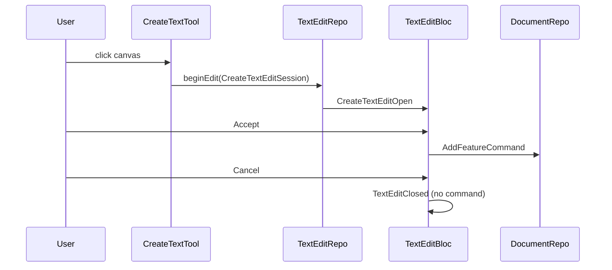

# Create Text Tool

## Approach

Add a small `CreateTextTool` that mirrors existing create-tool patterns (crosshair cursor, toolbar activation) but delegates feature creation to the **existing text edit modal pipeline**. Extend the text edit session/bloc with a lightweight **create mode** so nothing is written to the document until Accept—no placeholder features, no undo cleanup on cancel.



## 1. Extend text edit for create mode (subclasses)

Use sealed base classes with `final` subclasses—matching existing patterns like `TextEditState` and tool state machines.

**[`text_edit_repository.dart`](squiggle_flutter/lib/repositories/text_edit_repository.dart)**

Replace the single `TextEditSession` class with a sealed hierarchy. Shared fields live on the base; mode-specific data on subclasses:

```dart
sealed class TextEditSession {
  const TextEditSession({
    required this.initialContents,
    required this.canvasLocalBounds,
  });

  final String initialContents;
  final Rect canvasLocalBounds;
}

final class EditTextEditSession extends TextEditSession {
  const EditTextEditSession({
    required this.featureId,
    required super.initialContents,
    required super.canvasLocalBounds,
  });

  final FeatureId featureId;
}

final class CreateTextEditSession extends TextEditSession {
  const CreateTextEditSession({
    required this.worldOrigin,
    required super.initialContents,
    required super.canvasLocalBounds,
  });

  final Offset worldOrigin;
}
```

Repository stream type stays `Stream<TextEditSession>`; `beginEdit(TextEditSession session)` unchanged.

**[`state.dart`](squiggle_flutter/lib/editor/text_edit/bloc/state.dart)**

Mirror the session hierarchy for bloc state. `TextEditOverlay` only needs shared fields, so put them on the sealed base:

```dart
sealed class TextEditOpen extends TextEditState {
  const TextEditOpen({
    required this.initialContents,
    required this.canvasLocalBounds,
  });

  final String initialContents;
  final Rect canvasLocalBounds;
}

final class EditTextEditOpen extends TextEditOpen {
  const EditTextEditOpen({
    required this.featureId,
    required super.initialContents,
    required super.canvasLocalBounds,
  });

  final FeatureId featureId;
}

final class CreateTextEditOpen extends TextEditOpen {
  const CreateTextEditOpen({
    required this.worldOrigin,
    required super.initialContents,
    required super.canvasLocalBounds,
  });

  final Offset worldOrigin;
}
```

**[`bloc.dart`](squiggle_flutter/lib/editor/text_edit/bloc/bloc.dart)**

Map session → state with a `switch` on the sealed session type. Submit with exhaustive `switch` on `TextEditOpen`:

- **`EditTextEditOpen`**: existing `UpdateTextContentsCommand` path
- **`CreateTextEditOpen`**: build feature from `worldOrigin` + submitted contents via shared helper (see below), execute `AddFeatureCommand`
- **Empty contents on create**: treat as no-op (same as cancel—no feature added)

Cancel handler stays unchanged (just `TextEditClosed`).

**Shared text-placement helper** (small top-level functions, e.g. in new [`text_feature_placement.dart`](squiggle_flutter/lib/models/text_feature_placement.dart)):

- `defaultNewTextWidth = 200.0`, default colors matching seed data
- `newTextBoundsAt(Offset origin)` — world-space rect for overlay sizing/positioning
- `newTextFeatureAt(Offset origin, String contents)` — builds sized `Feature` with `FeatureKindText` + `measureContents()`

Used by **`CreateTextTool`** (bounds → `canvasLocalBounds` via camera) and **`TextEditBloc`** (feature → `AddFeatureCommand` on submit). Keeps session/state minimal and avoids bloc depending on a tool class.

**Call site updates**

- [`select_tool.dart`](squiggle_flutter/lib/tools/select_tool.dart): `EditTextEditSession(...)` instead of `TextEditSession(...)`
- Existing bloc tests: same rename to `EditTextEditSession` / `EditTextEditOpen`

Add bloc tests in [`text_edit_bloc_test.dart`](squiggle_flutter/test/editor/text_edit_bloc_test.dart) for `CreateTextEditSession` submit (feature added) and cancel (document unchanged).

## 2. Implement `CreateTextTool`

**New file: [`create_text_tool.dart`](squiggle_flutter/lib/tools/create_text_tool.dart)**

Minimal tool (~40 lines):

| Method | Behavior |
|--------|----------|
| `resolveCursor` | `EditorCursor.crosshair` |
| `paint` | no-op (no ghost preview) |
| `onPointerDown/Move` | no-op |
| `onPointerUp` | `beginEdit(CreateTextEditSession(worldOrigin: click, canvasLocalBounds: camera.worldToScreenBounds(newTextBoundsAt(click)), ...))` |
| `deactivate` | no-op |

No feature-building in the tool—only click location + overlay bounds via shared `newTextBoundsAt` helper.

**New test: [`create_text_tool_test.dart`](squiggle_flutter/test/tools/create_text_tool_test.dart)**

- Resolves crosshair cursor
- Click triggers `beginEdit` with create session (verify via `TextEditBloc` stream or captured session)
- Document unchanged until modal submit

## 3. Wire toolbar + shortcut

Follow the exact pattern used for rect/circle/line:

| File | Change |
|------|--------|
| [`state.dart`](squiggle_flutter/lib/editor/toolbar/bloc/state.dart) | `ActiveToolKind.createText` |
| [`event.dart`](squiggle_flutter/lib/editor/toolbar/bloc/event.dart) | `ActivateCreateTextToolEvent` |
| [`bloc.dart`](squiggle_flutter/lib/editor/toolbar/bloc/bloc.dart) | `setTool(CreateTextTool(), ...)` |
| [`editor_toolbar.dart`](squiggle_flutter/lib/editor/toolbar/widgets/editor_toolbar.dart) | New button after line tool |
| [`intents.dart`](squiggle_flutter/lib/editor/toolbar/widgets/shortcuts/intents.dart) | `ActivateCreateTextToolIntent` |
| [`shortcuts.dart`](squiggle_flutter/lib/editor/toolbar/widgets/shortcuts/shortcuts.dart) | `T` key binding + action |

Update [`shortcuts_test.dart`](squiggle_flutter/test/widgets/shortcuts_test.dart) if it asserts tool kinds.

## 4. Toolbar button with "A" icon

[`button.dart`](squiggle_flutter/lib/editor/toolbar/widgets/toolbar/button.dart) currently requires an SVG asset. Add an optional `label` parameter (e.g. `'A'`) rendered as styled `Text` when provided; keep `iconAsset` optional with an assert that one of the two is set. Use the same active/hover colors as SVG icons.

Toolbar usage:

```dart
Button(
  label: 'A',
  isActive: state.activeTool == ActiveToolKind.createText,
  onPressed: () => context.read<ToolbarBloc>().add(
    const ActivateCreateTextToolEvent(),
  ),
),
```

## What stays unchanged

- [`TextEditOverlay`](squiggle_flutter/lib/editor/text_edit/widgets/text_edit_overlay.dart) / [`TextEditPanel`](squiggle_flutter/lib/editor/text_edit/widgets/text_edit_panel.dart) — no changes needed
- [`DocumentViewport`](squiggle_flutter/lib/widgets/document_viewport.dart) canvas-disable-when-modal-open behavior
- [`ToolShortcuts`](squiggle_flutter/lib/editor/toolbar/widgets/shortcuts/shortcuts.dart) text-edit-open guard
- Select-tool double-click edit flow (uses `EditTextEditSession`)

## File summary

**New:** `create_text_tool.dart`, `text_feature_placement.dart`, `create_text_tool_test.dart`

**Modified:** `text_edit_repository.dart`, `text_edit/bloc/state.dart`, `text_edit/bloc/bloc.dart`, `select_tool.dart`, `text_edit_bloc_test.dart`, toolbar bloc (state/event/bloc), `editor_toolbar.dart`, `button.dart`, shortcuts (intents + shortcuts + test)
