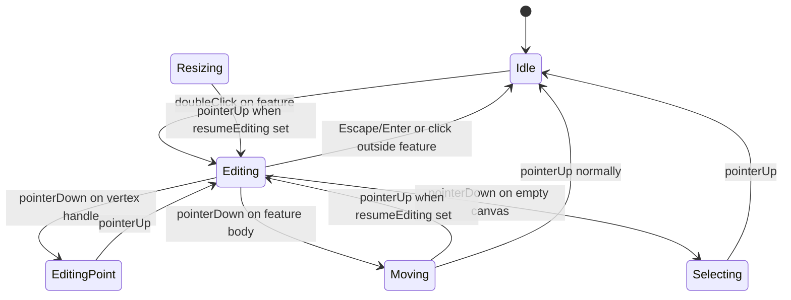

# Select Tool Edit Mode for Line Features

## Context

Selection interaction lives in [`select_tool.dart`](squiggle_flutter/lib/tools/select_tool.dart) with gesture states `_Idle`, `_Selecting`, `_Moving`, `_Resizing`. "Selected" is data in [`selection.dart`](squiggle_flutter/lib/repositories/selection.dart), not an FSM state. Polylines store vertices as `origin` + `FeatureKindPolyline.localPoints` ([`feature_geometry.dart`](squiggle_flutter/lib/models/feature_geometry.dart)). There is no per-vertex editing today — only whole-feature move and bbox scale via `applyBounds`.

Selection chrome is currently split: hit-testing lives in `SelectTool`, but bbox/handle **painting** lives in [`document_canvas.dart`](squiggle_flutter/lib/widgets/document_canvas.dart) (`_paintSelectionBox`). This plan co-locates interaction and visuals in `SelectTool`.

## Painting Architecture Change

Extend the `Tool.paint` signature in [`tool.dart`](squiggle_flutter/lib/tools/tool.dart) to mirror pointer handlers:

```dart
void paint(
  Canvas canvas,
  Camera camera,
  DocumentRepository documentRepository,
  SelectionRepository selection,
);
```

**`SelectTool.paint` paint order:**

1. Selection boxes + corner handles for all `selection.selectedFeatures`
2. Vertex handles when in `_Editing` / `_EditingPoint` and feature is a `FeatureKindPolyline`
3. Marquee overlay when `_Selecting` (existing, world-space)

**Move selection box code** from `document_canvas.dart` lines 233–285 into `SelectTool` (or a small `selection_overlay.dart` helper if `select_tool.dart` gets too large). Reuse existing constants: `kSelectionBoxPadding`, `kSelectionHandleHitSize`.

**Simplify `DocumentCanvas`:**

- `_paintFeatures` paints features only — no selection loop
- Call site: `_toolRepository.activeTool.paint(canvas, _camera, _documentRepository, _selectionRepository)`
- Remove `selectedFeatures` prop from `DocumentCanvas` and [`document_viewport.dart`](squiggle_flutter/lib/widgets/document_viewport.dart) (only used for selection painting today)
- Thread `selectionRepository` into `DocumentCanvas` if not already present

**Other tools:** `CreateLineTool` and `CreateFeatureTool` update signature and ignore new params (ghost preview stays world-space).

**Doc comment update:** `Tool.paint` runs after the world transform; overlays are mostly world-space, but selection/edit handles use screen-constant sizing via `camera` (same technique as today's `_paintSelectionBox`).

Selection only exists while the select tool is active (`SelectTool.deactivate()` clears selection on tool switch), so painting selection overlays only in `SelectTool` matches current behavior.

## FSM Design

Add two states to the existing sealed hierarchy:



| State | Role |
|-------|------|
| `_Editing` | Persistent resting state while editing `{ featureId }` |
| `_EditingPoint` | Transient drag of one vertex `{ featureId, pointIndex, dragOffset, didMove }` |

**Resume editing after gestures:** Add optional `FeatureId? resumeEditing` to `_Moving` and `_Resizing`. On `onPointerUp`, if `resumeEditing != null` → return to `_Editing(resumeEditing)` instead of `_Idle`.

## Entry: Double-Click Detection

No `GestureDetector` exists on the canvas — implement tap counting in `SelectTool` (same pattern as raw pointer events elsewhere):

- Fields: `_lastTapFeatureId`, `_lastTapTime`
- On `onPointerUp` in `_Moving` when `!didMove`: if same feature within ~300ms of last tap → `_Editing(featureId)` and reset tap tracker; else record tap
- Only enter edit when the clicked feature is the sole selection (or select it exclusively on double-click)

## Exit Edit Mode

| Trigger | Behavior |
|---------|----------|
| Escape / Enter | `_Editing` → `_Idle`; keep current selection |
| Click outside feature (empty canvas) | Exit edit + existing empty-click behavior (clear selection unless shift) |
| Click another feature | Exit edit + normal select/move flow for new feature |
| `deactivate()` | Clear edit state + selection (existing behavior) |

Implement `onKeyEvent` in `SelectTool` (mirror [`create_line_tool.dart`](squiggle_flutter/lib/tools/create_line_tool.dart) lines 177–197) — keys already fall through via [`shortcuts.dart`](squiggle_flutter/lib/editor/toolbar/widgets/shortcuts/shortcuts.dart).

## Edit-Mode Pointer Handling

In `onPointerDown`, when `_state is _Editing` (or editing context carried via `resumeEditing` during nested gestures):

1. **`_tryBeginEditPoint`** (new, checked before bbox resize): if editing a polyline, hit-test vertex handles in **screen space** (reuse `kSelectionHandleHitSize` / camera pattern from `_hitTestResizeHandle`)
2. Fall through to existing `_tryBeginResize` and feature move logic
3. Empty canvas: call `_exitEditing()` then proceed with `_Selecting`

In `onPointerMove`, handle `_EditingPoint` → apply point move via command.

In `onPointerUp`, `_EditingPoint` → `_Editing`; `_Moving`/`_Resizing` with `resumeEditing` → `_Editing`.

While in `_Editing` (resting), `onPointerMove` is a no-op (same as `_Idle`).

## Vertex Handle Rendering

Paint in `SelectTool.paint` using the same screen-constant 12px square style as selection corner handles. One handle per world vertex when `_Editing` / `_EditingPoint` targets a polyline. Bbox selection chrome stays unchanged — edit mode adds point handles on top for lines only.

## Cursor

In `resolveCursor`:

- `_EditingPoint` → `EditorCursor.grabbing`
- When in edit mode and hovering a polyline vertex → `EditorCursor.grab`
- Otherwise existing logic (bbox handles, feature grab, basic)

## Point Update Command

Add [`move_polyline_point_command.dart`](squiggle_flutter/lib/models/commands/move_polyline_point_command.dart) as a `part of` [`command.dart`](squiggle_flutter/lib/models/commands/command.dart):

```dart
MovePolylinePointCommand(featureId, pointIndex, worldPosition)
```

Apply logic (uses existing geometry helpers):

```dart
final points = worldPoints(feature.origin, localPoints);
points[pointIndex] = worldPosition;
final newOrigin = points.first;
final newLocal = localPointsFromWorld(points, newOrigin);
feature.moveTo(newOrigin);
feature.kind = polyline.copyWith(localPoints: newLocal);
feature.size = feature.bounds().size;
```

Capture `previousOrigin` + `previousLocalPoints` on first apply for undo (same pattern as [`move_feature_command.dart`](squiggle_flutter/lib/models/commands/move_feature_command.dart)).

During drag, call `executeCommand` on each move (consistent with existing move/resize behavior).

## Non-Line Features in Edit Mode

Double-click enters `_Editing` for any feature type. Only polylines get vertex handles and `_EditingPoint` drag. Rects/circles behave identically to normal selection until future work — but Escape/click-out still exits edit mode.

## Tests

Extend [`select_tool_test.dart`](squiggle_flutter/test/tools/select_tool_test.dart):

- Double-click polyline → enters edit mode (verify via vertex drag behavior)
- Escape exits edit mode, selection preserved
- Empty click exits edit mode and clears selection
- Drag vertex handle moves that point (verify world position of moved vertex)
- Undo restores previous geometry
- Non-polyline double-click enters edit mode without vertex side effects

Add command unit test in [`commands_test.dart`](squiggle_flutter/test/models/commands_test.dart) for index-0 (re-origin) and middle vertex moves.

## Files to Change

| File | Change |
|------|--------|
| [`tool.dart`](squiggle_flutter/lib/tools/tool.dart) | Extend `paint` signature + doc comment |
| [`select_tool.dart`](squiggle_flutter/lib/tools/select_tool.dart) | Selection overlay painting, `_Editing`, `_EditingPoint`, double-click, exit, hit-test, cursor, key handler |
| [`create_line_tool.dart`](squiggle_flutter/lib/tools/create_line_tool.dart) | Update `paint` signature |
| [`create_feature_tool.dart`](squiggle_flutter/lib/tools/create_feature_tool.dart) | Update `paint` signature |
| [`document_canvas.dart`](squiggle_flutter/lib/widgets/document_canvas.dart) | Remove selection painting + `selectedFeatures` prop; pass repos to `paint` |
| [`document_viewport.dart`](squiggle_flutter/lib/widgets/document_viewport.dart) | Stop passing `selectedFeatures` to canvas |
| [`command.dart`](squiggle_flutter/lib/models/commands/command.dart) | `part` for new command |
| `move_polyline_point_command.dart` | New command |
| [`select_tool_test.dart`](squiggle_flutter/test/tools/select_tool_test.dart) | Edit mode interaction tests |
| [`commands_test.dart`](squiggle_flutter/test/models/commands_test.dart) | Command undo tests |

`repaintStream` already triggers canvas repaints on tool state changes; selection changes still flow via `SelectionRepository` stream → `EditorBloc` → viewport rebuild.
